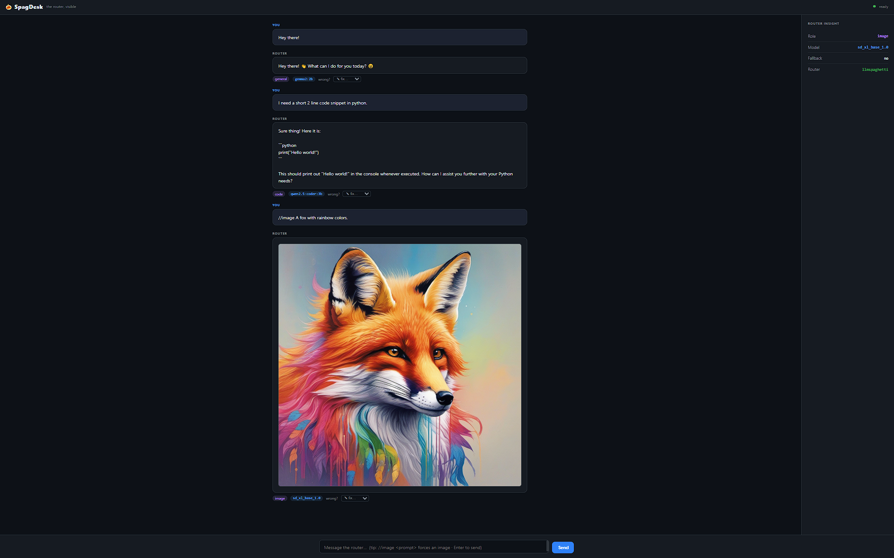
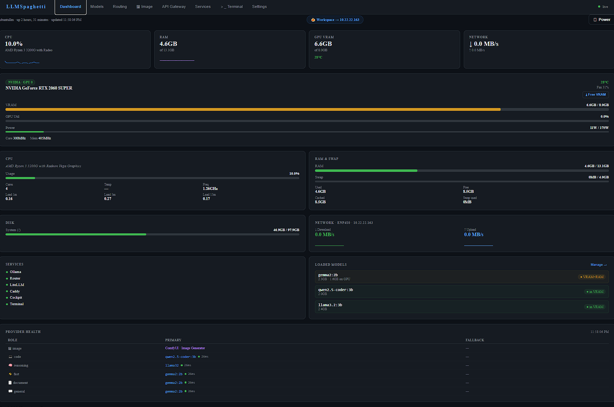
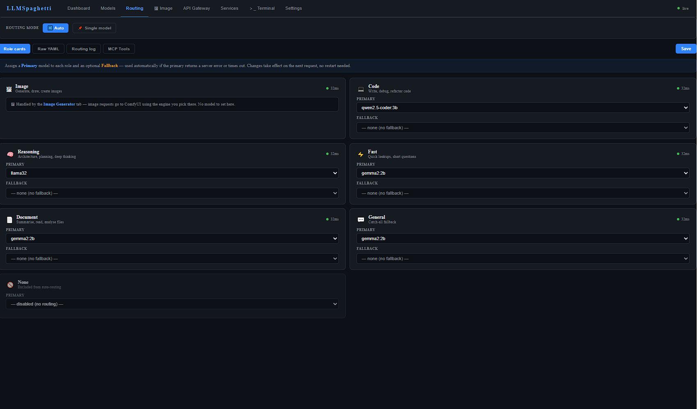
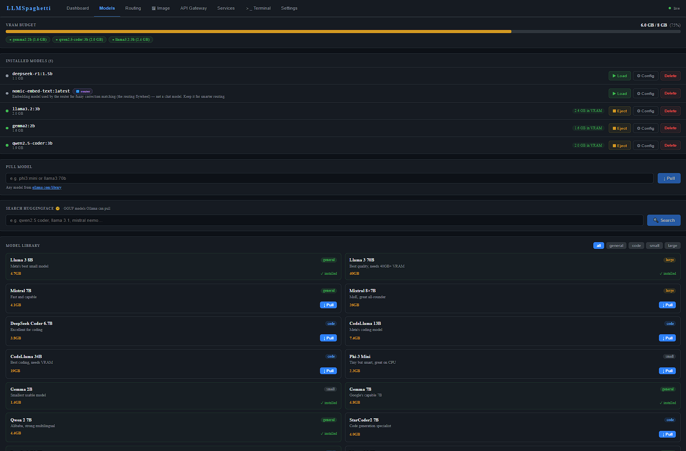
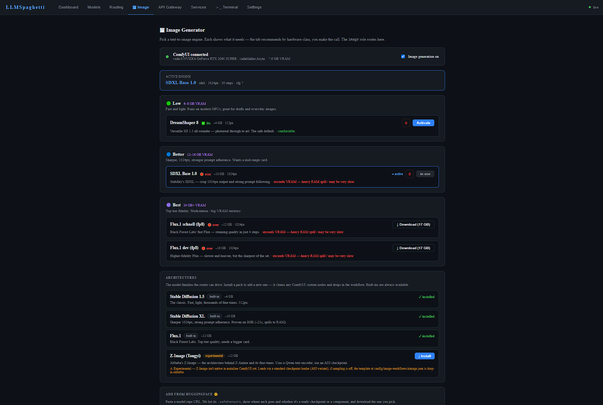

# 🍝 LLMSpaghetti


> A tangled mess of AI routing that somehow works.

One endpoint. One chat window. Every model you have — local and cloud —
and it silently sends each message to the right one.

---

> ⚠️ **HONEST DISCLAIMER — PLEASE READ**
>
> This is a **hobby project** built for fun. The code is, by the author's own
> admission, **vibecoded spaghetti** — held together with bash, enthusiasm, and a
> concerning amount of optimism.
>
> **Use at your own risk.** The authors take zero responsibility for anything
> that happens to your hardware, data, API bills, pets, or general wellbeing as a
> result of running this software. No warranty, no support, updates when they
> happen. Full terms: [DISCLAIMER.md](DISCLAIMER.md).

---

## What is it?

LLMSpaghetti turns a spare PC into a self-hosted **AI router**. You talk to a
single chat window; behind it, a router reads each message, works out what you
need, and routes it to the best model — a local coder model for code, a
reasoning model for "think this through", a local **image** model for "draw
me…", a cloud model if you want one — all without you choosing. One URL for
every OpenAI-compatible tool (Cursor, Continue, Aider, your own scripts).

```
You  →  one chat / one /v1 endpoint  →  Router (classifies)  →  the right model
                                                                 (text · code · image,
                                                                  local or cloud)
```

## Why build it?

Anyone using AI seriously ends up juggling six tabs and four API keys, manually
picking a model per task and sending everything to the cloud whether it needs to
go there or not. LLMSpaghetti collapses that into one place **you** own.

- **Local-first (the point):** a homelab box with a GPU, several local models,
  each assigned a job. Nothing leaves your network unless you add a cloud key.
- **Or router-only:** an old laptop with no GPU that just routes your existing
  cloud subscriptions through one endpoint for every device in the house.

You set the rules. LLMSpaghetti enforces them — and **shows its work** (every
answer will tell you which model handled it).

---

## See it work

**One chat. The router picks the model per message — text, code, and images, no switching.**



> *"Hey there!"* → **general** (gemma2:2b) · *"a 2-line Python snippet"* → **code**
> (qwen2.5-coder:3b) · *`//image a fox with rainbow colors`* → **image** (SDXL via
> ComfyUI). Three models, three roles, one conversation — the panel on the right
> names exactly who answered. All local, on a single 8GB card.

### The control plane

Everything is managed from a [Cockpit](https://cockpit-project.org) dashboard —
GPU/VRAM, model downloads, routing rules, image engines, and one-click service
installs (ComfyUI, Open WebUI, ROCm, MCP tools, …).

<p align="center">
  
  
  
  
</p>

---

## Status

**Works today** (proven on a real GPU box — RTX 2060 Super 8GB, Ubuntu 26.04):

- **Multi-model text routing** — each message classified and sent to the right
  local model automatically (general / code / reasoning), GPU-accelerated.
- **Images in the same chat** — `//image <prompt>` (or "draw me…") routes to a
  local **ComfyUI** engine; SD 1.5, SDXL and Z-Image proven. The router hands VRAM
  back and forth between chat and image models to fit a single 8GB card.
- **SpagDesk** — a built-in chat/workspace that shows the routing live (which role,
  which model), so nothing is hidden. Open WebUI is an optional install.
- **Cloud when you want it** — add a key and route to cloud models through the same
  endpoint; a **provenance tag** on every reply tells you who answered.
- **One control plane** — Cockpit dashboard for models, routing, image engines,
  GPU/VRAM, and tap-to-install services.

**Not built yet:** the bootable ISO (install is `git clone` + bootstrap for now),
the VS Code extension, and multi-node. Full picture in [TODO.md](TODO.md) and
[CHANGELOG.md](CHANGELOG.md).

---

## Milestones

- **Images in one chat** — *2026-07-06* — `//image` generates locally via ComfyUI
  (SDXL / Z-Image) in the same conversation as text and code, with the router
  automatically freeing and restoring VRAM on a single 8GB card.
- **First GPU deployment** — *2026-07-01* — full stack on real hardware
  (RTX 2060 Super); code vs general questions routed to different local models
  through the chat UI, fast, no soft-lock.
- **Routing proven** — *2026-06-27* — end-to-end classify → route → reply on a
  CPU VM; the core thesis works.

---

## Documentation

| I want to… | Go to |
|---|---|
| Install & set it up | [docs/install.md](docs/install.md) |
| Understand how it works | [docs/technical.md](docs/technical.md) |
| Read the vision / scope | [PROJECT-SCOPE.md](PROJECT-SCOPE.md) |
| See what's planned / done | [TODO.md](TODO.md) |
| See what changed | [CHANGELOG.md](CHANGELOG.md) |
| Contribute | [CONTRIBUTING.md](CONTRIBUTING.md) |
| Browse all docs | [docs/](docs/README.md) |

---

## Security

LLMSpaghetti is a **self-hosted LAN appliance** — the router and LiteLLM bind to
`localhost` behind Caddy, and the master key is generated randomly per install. If
you expose the box to the internet, harden it first (change the default token, add
auth in front of the endpoints, lock down Cockpit). See
**[SECURITY.md](SECURITY.md)** for the security model and how to report a
vulnerability privately.

---

## Acknowledgements

LLMSpaghetti is glue and a routing brain on top of excellent open-source
projects. It would not exist without them:

- **[Ollama](https://ollama.com)** — runs the local text models
- **[ComfyUI](https://github.com/comfyanonymous/ComfyUI)** — runs the local image models
- **[LiteLLM](https://litellm.ai)** — unified gateway to 100+ cloud providers
- **[Open WebUI](https://github.com/open-webui/open-webui)** — optional drop-in chat
  client (SpagDesk, our own, is the built-in default)
- **[Llama](https://ai.meta.com/llama/)** and the wider open-weight model
  community (Qwen, Mistral, Gemma, DeepSeek, …) — the models that make local
  inference possible
- **[Cockpit](https://cockpit-project.org)** · **[ttyd](https://github.com/tsl0922/ttyd)** ·
  **[Caddy](https://caddyserver.com)** · **[Docker](https://www.docker.com)** ·
  **Ubuntu** — the appliance plumbing

We orchestrate these tools; we don't reinvent them. Thank you to everyone who
builds and maintains them.

---

## License

GPL v3 — see [LICENSE](LICENSE). Use it, modify it, share your changes.

---

*Yes, it's spaghetti. Yes, it works. Somehow.* 🍝
